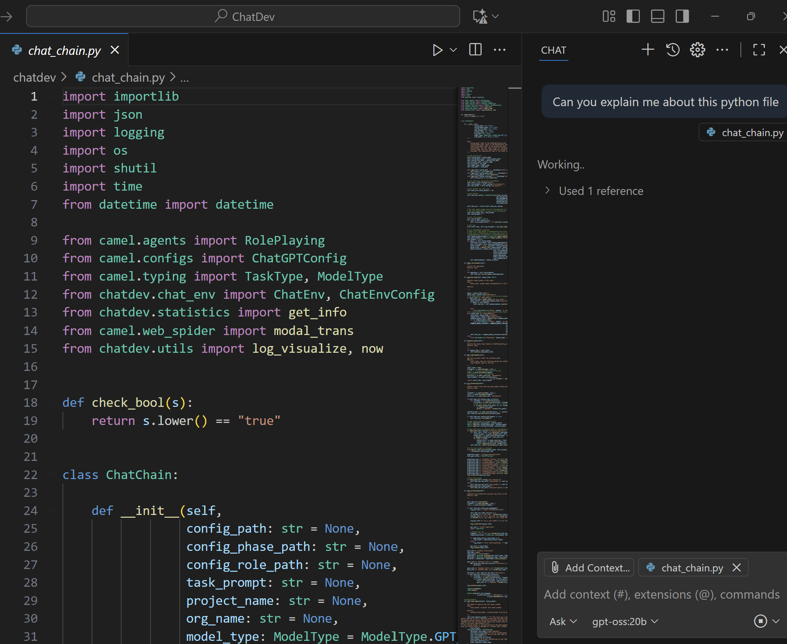

# RAG

RAG or Retrieval-Augmented Generation, is an AI framework that enhances large language models (LLMs) by connecting them to external knowledge bases to provide more accurate, current, and domain-specific information. 

## Following steps are needed for configuring RAG

python3 -m venv venv312; source venv312/bin/activate;
pip install langchain_community;
pip install langchain_experimental;
pip install streamlit;
pip install pdfplumber;
pip install sentence-transformers;
pip install "-U" langchain-huggingface;
pip install faiss-cpu;

## Populating with data

Populate the folder \\wsl.localhost\Ubuntu\home\user\Documents with books, while the cloned repo is here \\wsl.localhost\Ubuntu\home\user\SLM-as-agent, run as "python3 rag/train.py"

# Running GPT-OSS-20b SLM locally!

## Introduction

I want to use a SLM, **GPT-OSS-20b** from OpenAI so that when I use VS Code. How can I use this locally stored pre-trained LLM instead of GitHub CoPilot?

## Create files and folders

We can run a local **20 B GPT‑OSS** model (or any LLM that runs on your machine) and hook it into VS Code instead of using cloud‑based GitHub Copilot.

The trick is to expose the model as an API that looks like OpenAI’s endpoint, then point a VS Code extension at that local endpoint. Below are two practical ways to do this:

1.  Run the model with a lightweight local inference engine (e.g., Ollama, vLLM, or Hugging‑Face Inference Server).
2.  Create/modify an existing VS Code extension so it talks to your local server.

| Option |  What you need |  Typical RAM / GPU |  Pros | Cons |
|----------|--------------------|--------------|-------|------|
**Ollama**  | ~12 GB VRAM (or 40 GB+ if you want low‑latency) |  Zero‑config, auto‑downloads models, supports  `chat/completions`. |  Not as fast as a fully custom vLLM deployment. |

## Install Olama and use the model

curl -fsSL https://ollama.ai/install.sh | sh

Test whether Olama is running by following command:

http://localhost:11434

ollama pull gpt-oss:20b

[Reference : OpenAI's gpt-oss:20b model](https://ollama.com/library/gpt-oss)

ollama serve

If server cannot be started

sudo lsof -i :11434

sudo systemctl stop ollama

### Generating a response

curl http://localhost:11434/api/generate -H "Content-Type: application/json" -d '{
  "model": "gpt-oss:20b",
  "prompt": "Explain recursion in Python."
}'

### Chatting with the model in Ollama

curl -X POST http://localhost:11434/api/chat -H "Content-Type: application/json" -d '{
  "model": "gpt-oss:20b",
  "stream": false,
  "messages": [{ "role": "user", "content": "Explain recursion in Python" }]
}'

### Formatting and adding additional switches

The chat to Ollama is below:

curl -X POST http://localhost:11434/api/chat -H "Content-Type: application/json" -d '{ 
   "model": "gpt-oss:20b", 
   "stream": false, 
   "messages": [{ "role": "user", "content": "Explain recursion in Python" }] 
}'

Go to VS Code, on the lower right corner click "Manage Models" then type Ollama and then you should see gpt-oss:20b, select it.
Then select that model for coding. The screen shot below shows how it can be done:

## How to set up VS Code to use SLM (gpt-oss:20b in Ollama)

## Reference

[Reference : RAG Deep Seek R1](https://apidog.com/blog/rag-deepseek-r1-ollama/)

[Reference : Ollama API](https://github.com/ollama/ollama)

